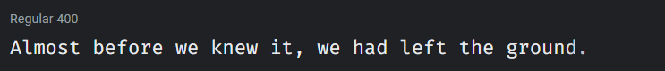
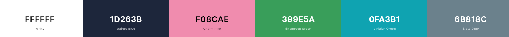

# BtissamYAQINE 
This is my personal portfolio have my Skills, Experiences Professional, Education, Projects Worked and Work On.
# [BtissamYAQINE](https://btissamyaqine.github.io/)

    
    
    
    
    

  

## Design

### Fonts

[Fire Code](https://fonts.google.com/specimen/Fira+Code) - headings and code text

[Nunito](https://fonts.google.com/specimen/Nunito) - normal text

### Color Scheme

- White - all normal text color
- Oxford Blue - page background color, text color on white background
- Charm Pink - links, nav bar item hover, icon hover color
- Shamrock Green - Charm Pink links hover color
- Viridian Green - project skill text color
- Slate Gray - mobile navbar background color

## Built With

- 💙 [HTML5](https://www.w3schools.com/html/)
- 💜 [CSS3](https://www.w3schools.com/css/)
- 💙 [JavaScript](https://www.w3schools.com/js/DEFAULT.asp)
- 💜 [Flaticon](https://www.flaticon.com/) and [FontAwesome](https://fontawesome.com/v5.15/icons?d=gallery&p=1) for the icons

---

## Creator 

Btissam YAQINE ([btissamyaqine](https://github.com/btissamyaqine))

If you have any questions, comments, or concerns, feel free to contact me below.

  

This project was created for educational purposes and for personal use. Feel free to take inspiration.

